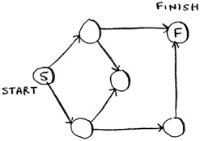
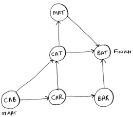
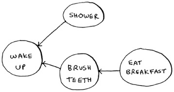
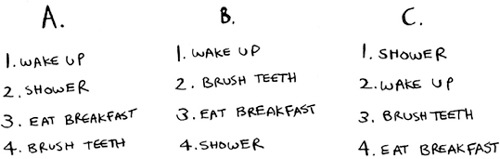
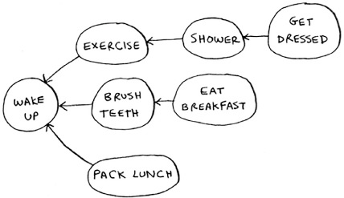
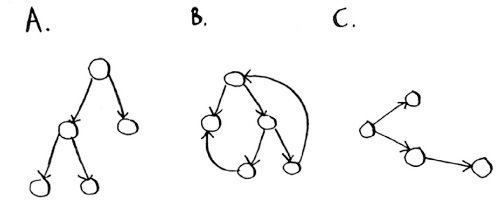

# Breadth-First Search

- Breadth-first search (BFS) allows you to find the shortest distance between two things.
- Shortest-path problems are solved by:
  - Modeling the problem as a graph
  - Solving the problem using breadth-first search
- A graph models a set of connections.
- Graphs are made up of nodes and edges.
- One node can be directly connected to many nodes (its _neighbors_)
- Breadth-first search can also solve if a path from one node to another exists.
- A _queue_ allows for assuring first-degree connections are evaluated first.
- Queue only has two operations: enqueue and dequeue
- Queue is called a FIFO data structure: First In, First Out
- Stack is called a LIFO data structure: Last In, First Out

- Exercises:
    - `6.1` Find the length of the shortest path from start to finish. 
        - 2
    - `6.2` Find the length of the shortest path from “cab” to “bat”. 
        - 2
    
- A hash table will allow to map a node to other nodes
- In a _directed graph_, the relationship is only one way
- In an _undirected graph_, the relationship is mutual (both ways)
- BFS running time is O(V + E)
  - V for number of vertices, E for number of edges
    
- Exercises: <br>Based on this graph of a morning routine 
    - `6.3` For these three lists, mark whether each one is valid or invalid. 
        - A. invalid, B. valid, C. invalid
    - `6.4` Here’s a larger graph. Make a valid list for this graph. 
        - ```
          1. Wake up
          2. Pack lunch
          3. Brush teeth
          4. Exercise
          5. Shower
          6. Get dressed
          7. Eat breakfast
            ```
    - `6.5` Which of the following graphs are also trees? 
        - A, C
    
- A _topological sort_ is a way to make an ordered list out of a graph
- A _tree_ is a special type of graph, where no edges ever point back

- Recap
    - Breadth-first search tells you if there’s a path from A to B.
    - If there’s a path, breadth-first search will find the shortest path.
    - If you have a problem like “find the shortest X,” try modeling your problem as a graph, and use breadth-first search to solve.
    - A directed graph has arrows, and the relationship follows the direction of the arrow (rama -> adit means “rama owes adit money”).
    - Undirected graphs don’t have arrows, and the relationship goes both ways (ross - rachel means “ross dated rachel and rachel dated ross”).
    - Queues are FIFO (First In, First Out).
    - Stacks are LIFO (Last In, First Out).
    - You need to check people in the order they were added to the search list, so the search list needs to be a queue. Otherwise, you won’t get the shortest path.
    - Once you check someone, make sure you don’t check them again. Otherwise, you might end up in an infinite loop.
